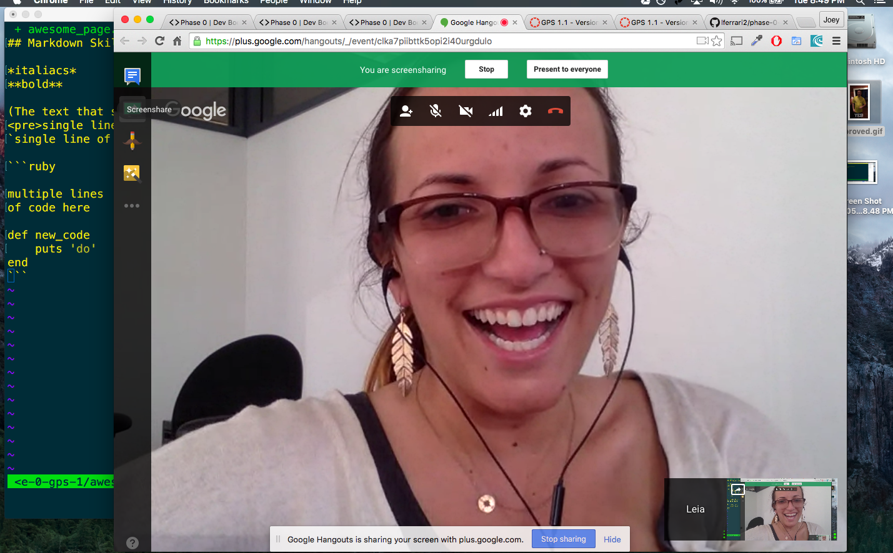

## Markdown Skills

*italiacs*
**bold**

[The text that shows](http://devbootcamp.com)
<pre>single line</pre>
`single line of code`

```ruby

multiple lines
of code here

def new_code
    puts 'do'
end
```


